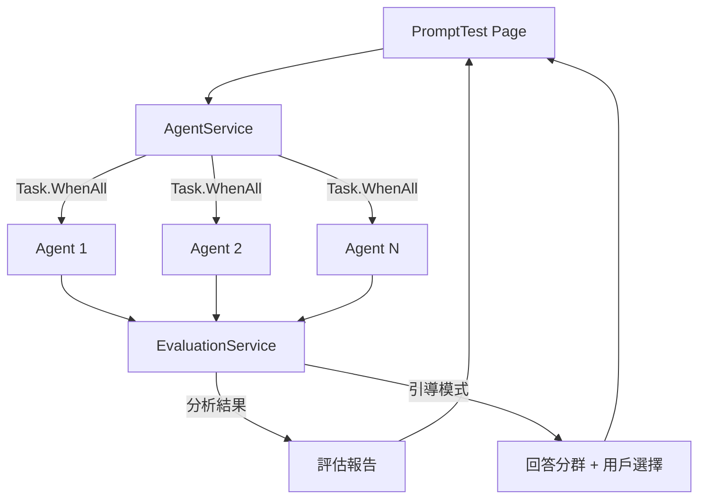

# ⚡ PromptAgent

> Prompt 優化測試系統 - 使用 Microsoft Agent Framework 進行智慧評估與多輪優化


## ✨ 功能特色

- 🤖 **Microsoft Agent Framework** - 使用 `ChatClientAgent` 統一 AI 呼叫，支援智慧路由
- 🚀 **多輪平行執行** - 使用 `Task.WhenAll` 同時執行多個 Agent，快速測試 Prompt 穩定性
- 🧠 **GAI 可行性評估** - 智慧分析需求適合使用 GAI、傳統程式、還是人工處理
- 📚 **Prompt 版本控制** - 像 Git 一樣管理 Prompt 版本，支援回滾、標籤、Diff 比較
- 📊 **成本比較視覺化** - Chart.js 圖表展示三種方案的成本與能力比較
- ✨ **一鍵優化建議** - 自動生成優化後的 Prompt，一鍵套用立即改善效果
- 🎲 **AI 生成範例** - 使用 LLM 動態生成測試範例，支援數學、邏輯、翻譯、程式碼等類別
- 🎯 **引導模式** - 人機協作優化，每輪暫停讓您選擇偏好的回答風格
- 🔄 **Meta-Prompt 優化** - Evaluator 自動學習調整策略，根據優化效果動態切換模式
- 📜 **歷史紀錄** - 測試結果自動保存到瀏覽器 LocalStorage，隨時查看過往紀錄

## 🆕 智慧路由架構

GAI 評估服務使用 **Router Agent** 智慧判斷需求複雜度：

```
[用戶需求] → [RouterAgent] → SIMPLE / COMPLEX
                               ↓
            SIMPLE → 快速回應 (~2秒) - 直接推薦程式方案
            COMPLEX → 完整分析 (~10秒) - 三方案比較 + 程式碼建議
```

## 📸 截圖

### 首頁


### Prompt 測試頁面


## 🎮 三種測試模式

| 模式 | 說明 | 適用場景 |
|------|------|----------|
| ▶️ **一般測試** | 單次執行 + AI 評估 | 快速驗證 Prompt 效果 |
| 🚀 **智慧修正** | 全自動多輪優化 | 信任 AI 判斷，自動迭代 |
| 🎯 **引導模式** | 每輪暫停，用戶參與決策 | 需要精確控制優化方向 |

## 🛠️ 環境需求

- [.NET 10.0](https://dotnet.microsoft.com/download) 或更高版本
- [Azure OpenAI Service](https://azure.microsoft.com/en-us/products/cognitive-services/openai-service/) 帳戶

## 🚀 快速開始

### 1. 複製專案

```bash
git clone https://github.com/yourusername/PromptAgent.git
cd PromptAgent
```

### 2. 配置 Azure OpenAI

複製範本檔案並填入你的 Azure OpenAI 連線資訊：

```bash
cp appsettings.template.json appsettings.json
```

然後編輯 `appsettings.json`：

```json
{
  "AzureOpenAI": {
    "Provider": "Azure",
    "Endpoint": "https://your-resource.openai.azure.com/",
    "ApiKey": "your-api-key",
    "DeploymentName": "gpt-4o-mini",
    "EvaluatorEndpoint": "https://your-evaluator-resource.openai.azure.com/",
    "EvaluatorApiKey": "your-evaluator-api-key",
    "EvaluatorDeploymentName": "gpt-4o"
  }
}
```

> 💡 **提示**: 建議使用較強的模型（如 GPT-4o）作為評估者，以獲得更準確的分析結果。

### 🔌 使用 LiteLLM / OpenAI 兼容端點

本專案也支援使用 LiteLLM 或其他 OpenAI 兼容的 API。只需調整 `appsettings.json`：

```json
{
  "AzureOpenAI": {
    "Provider": "OpenAI",
    "Endpoint": "http://localhost:4000/v1",
    "ApiKey": "sk-1234",
    "DeploymentName": "gpt-4o-mini",
    "EvaluatorEndpoint": "http://localhost:4000/v1",
    "EvaluatorApiKey": "sk-1234",
    "EvaluatorDeploymentName": "gpt-4o"
  }
}
```

- **Provider**: 設定為 `"OpenAI"`
- **Endpoint**: 設定為 LiteLLM 服務位置 (例如 `http://localhost:4000/v1`)
- **DeploymentName**: 對應到 LiteLLM 中的 Model Name

### 3. 執行專案

```bash
dotnet run
```

### 4. 開啟瀏覽器

訪問 http://localhost:5036

## 📁 專案結構

```
PromptAgent/
├── Models/
│   ├── TestCase.cs              # 測試案例模型
│   ├── TestResult.cs            # 測試結果模型
│   ├── EvaluationModels.cs      # GAI 評估模型
│   ├── GuidedModeModels.cs      # 引導模式模型
│   └── PromptVersion.cs         # 版本控制模型
├── Services/
│   ├── AgentService.cs          # Agent 管理服務 (MAF ChatClientAgent)
│   ├── GAIEvaluatorService.cs   # GAI 可行性評估 (智慧路由)
│   ├── EvaluationService.cs     # 評估服務 (分析 + 引導模式)
│   ├── ExampleGeneratorService.cs # LLM 驅動的範例生成
│   ├── MetaEvaluatorService.cs  # Meta-Prompt 自適應優化
│   └── PromptVersionService.cs  # Prompt 版本控制 (LocalStorage)
├── Components/
│   ├── Layout/                  # 版面配置
│   └── Pages/                   # 頁面元件
│       ├── PromptTest.razor     # Prompt 測試頁面
│       ├── GAIEvaluator.razor   # GAI 可行性評估頁面
│       └── PromptVersions.razor # Prompt 版本控制頁面
└── appsettings.json             # 配置檔案
```

## 🎯 使用方法

### 一般測試
1. 點擊類別按鈕（🧮 數學、🧩 邏輯、🌐 翻譯、💻 程式）讓 AI 自動生成範例
2. 填寫 **System Prompt**、**測試問題**、**預期答案**
3. 選擇 **執行次數**（建議 3-5 次）
4. 點擊「**開始測試**」
5. 查看評分和優化建議

### 智慧修正模式
1. 設定優化輪數和目標分數
2. 點擊「**啟動智慧修正**」
3. 系統自動多輪迭代優化直到達標

### 引導模式
1. 點擊「**🎯 啟動引導模式**」
2. 第一輪執行後，AI 會分析回答風格並分群
3. 選擇您偏好的風格，或輸入自訂反饋
4. 點擊「繼續下一輪」繼續優化
5. 滿意後點擊「滿意，結束」

### 📚 Prompt 版本控制

像 Git 一樣管理你的 Prompt 版本：

**建立專案**
1. 點擊側邊欄「📚 版本控制」
2. 點擊「➕ 新專案」
3. 輸入專案名稱（如「翻譯助手」）

**儲存版本**
1. 在編輯器輸入 System Prompt / Question / Expected Answer
2. 點擊「💾 儲存新版本」
3. 每次修改都會建立新版本 (v1, v2, v3...)

**回滾版本**
1. 在版本列表找到想要的版本
2. 點擊「載入」將該版本內容載入編輯器
3. 可再儲存為新版本

**標記 Best 版本**
1. 點擊「標記 Best」為最佳版本加上 ⭐ 標籤
2. Best 標籤是唯一的，新的 Best 會取消舊的

**整合測試頁面**
1. 在版本控制頁點「🧪 前往測試」
2. 可將編輯器內容帶到 Prompt 測試頁面進行測試

> 💡 所有資料儲存在瀏覽器 LocalStorage，不會上傳到任何伺服器

### 💾 資料儲存說明

所有紀錄都存在**瀏覽器的 LocalStorage**：

| 功能 | Key | 說明 |
|------|-----|------|
| Prompt 測試歷史 | `prompt_test_history` | 最多 30 筆 |
| GAI 評估歷史 | `gai_evaluation_history` | 最多 20 筆 |
| 版本控制專案 | `prompt_projects` | 專案列表 |
| 版本控制版本 | `prompt_versions_{id}` | 各專案版本 |

> ⚠️ **注意**: 清除瀏覽器資料會刪除這些紀錄。如需備份，可在 DevTools (F12) → Application → Local Storage 匯出

## 🔧 技術架構



## 📝 授權

MIT License

## 🤝 貢獻

歡迎提交 Issue 和 Pull Request！
