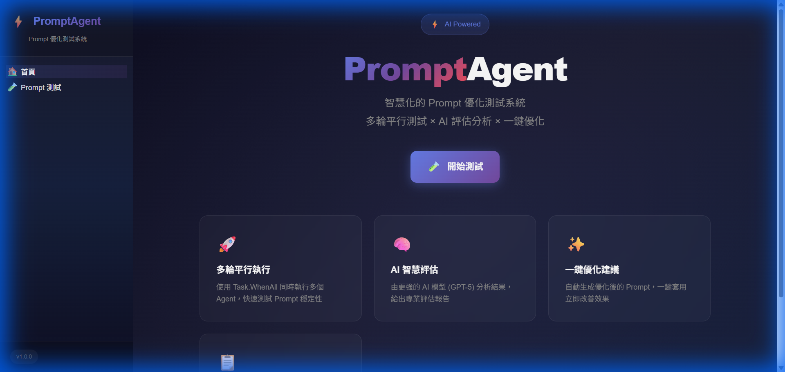
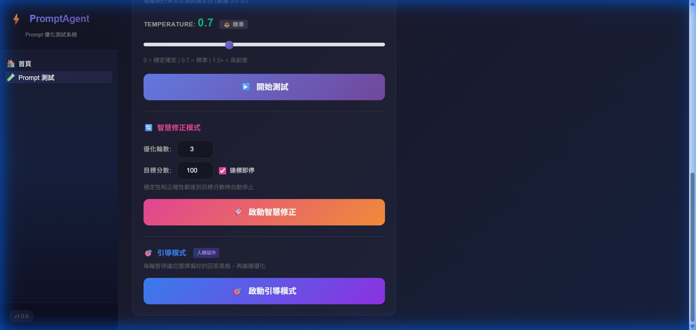
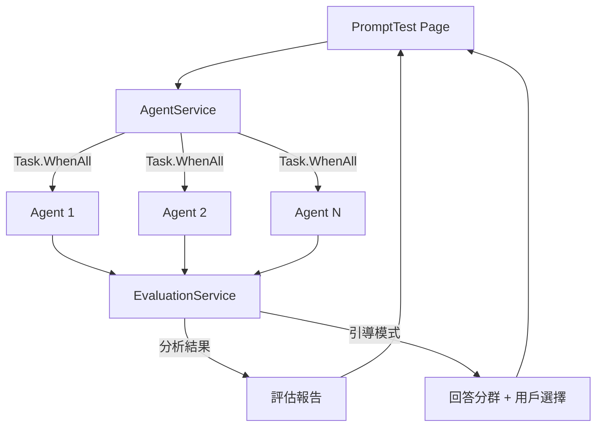

# ⚡ PromptAgent

> Prompt 優化測試系統 - 使用多輪平行測試和 AI 智慧評估來優化你的 Prompt


## ✨ 功能特色

- 🚀 **多輪平行執行** - 使用 `Task.WhenAll` 同時執行多個 Agent，快速測試 Prompt 穩定性
- 🧠 **AI 智慧評估** - 由更強的 AI 模型分析結果，給出專業評估報告
- ✨ **一鍵優化建議** - 自動生成優化後的 Prompt，一鍵套用立即改善效果
- 🎲 **AI 生成範例** - 使用 LLM 動態生成測試範例，支援數學、邏輯、翻譯、程式碼等類別
- 🎯 **引導模式** - 人機協作優化，每輪暫停讓您選擇偏好的回答風格
- 🔄 **Meta-Prompt 優化** - Evaluator 自動學習調整策略，根據優化效果動態切換模式

## 🧬 Meta-Prompt Optimization (新功能！)

系統會追蹤每輪優化的效果，並自動調整 Evaluator 的策略：

| 策略 | 觸發條件 | 行為 |
|-----|---------|-----|
| 🛡️ **保守模式** | 連續 2 輪分數下降 | 小幅修改，保留原結構 |
| 🚀 **激進模式** | 連續 3 輪分數停滯 | 大膽嘗試新方向 |
| 🎯 **穩定優先** | 穩定性明顯低於正確性 | 專注減少輸出變異 |
| ✓ **正確優先** | 正確性明顯低於穩定性 | 專注提升答案品質 |

## 📸 截圖

### 首頁


### Prompt 測試頁面


## 🎮 三種測試模式

| 模式 | 說明 | 適用場景 |
|------|------|----------|
| ▶️ **一般測試** | 單次執行 + AI 評估 | 快速驗證 Prompt 效果 |
| 🚀 **智慧修正** | 全自動多輪優化 | 信任 AI 判斷，自動迭代 |
| 🎯 **引導模式** | 每輪暫停，用戶參與決策 | 需要精確控制優化方向 |

## 🛠️ 環境需求

- [.NET 10.0](https://dotnet.microsoft.com/download) 或更高版本
- [Azure OpenAI Service](https://azure.microsoft.com/en-us/products/cognitive-services/openai-service/) 帳戶

## 🚀 快速開始

### 1. 複製專案

```bash
git clone https://github.com/yourusername/PromptAgent.git
cd PromptAgent
```

### 2. 配置 Azure OpenAI

複製範本檔案並填入你的 Azure OpenAI 連線資訊：

```bash
cp appsettings.template.json appsettings.json
```

然後編輯 `appsettings.json`：

```json
{
  "AzureOpenAI": {
    "Provider": "Azure",
    "Endpoint": "https://your-resource.openai.azure.com/",
    "ApiKey": "your-api-key",
    "DeploymentName": "gpt-4o-mini",
    "EvaluatorEndpoint": "https://your-evaluator-resource.openai.azure.com/",
    "EvaluatorApiKey": "your-evaluator-api-key",
    "EvaluatorDeploymentName": "gpt-4o"
  }
}
```

> 💡 **提示**: 建議使用較強的模型（如 GPT-4o）作為評估者，以獲得更準確的分析結果。

### 🔌 使用 LiteLLM / OpenAI 兼容端點

本專案也支援使用 LiteLLM 或其他 OpenAI 兼容的 API。只需調整 `appsettings.json`：

```json
{
  "AzureOpenAI": {
    "Provider": "OpenAI",
    "Endpoint": "http://localhost:4000/v1",
    "ApiKey": "sk-1234",
    "DeploymentName": "gpt-4o-mini",
    "EvaluatorEndpoint": "http://localhost:4000/v1",
    "EvaluatorApiKey": "sk-1234",
    "EvaluatorDeploymentName": "gpt-4o"
  }
}
```

- **Provider**: 設定為 `"OpenAI"`
- **Endpoint**: 設定為 LiteLLM 服務位置 (例如 `http://localhost:4000/v1`)
- **DeploymentName**: 對應到 LiteLLM 中的 Model Name

### 3. 執行專案

```bash
dotnet run
```

### 4. 開啟瀏覽器

訪問 http://localhost:5036

## 📁 專案結構

```
PromptAgent/
├── Models/
│   ├── TestCase.cs              # 測試案例模型
│   ├── TestResult.cs            # 測試結果模型
│   └── GuidedModeModels.cs      # 引導模式模型
├── Services/
│   ├── AgentService.cs          # Agent 管理服務 (平行執行)
│   ├── EvaluationService.cs     # 評估服務 (分析 + 引導模式)
│   ├── ExampleGeneratorService.cs # LLM 驅動的範例生成
│   └── MetaEvaluatorService.cs  # Meta-Prompt 自適應優化
├── Components/
│   ├── Layout/                  # 版面配置
│   └── Pages/                   # 頁面元件
└── appsettings.json             # 配置檔案
```

## 🎯 使用方法

### 一般測試
1. 點擊類別按鈕（🧮 數學、🧩 邏輯、🌐 翻譯、💻 程式）讓 AI 自動生成範例
2. 填寫 **System Prompt**、**測試問題**、**預期答案**
3. 選擇 **執行次數**（建議 3-5 次）
4. 點擊「**開始測試**」
5. 查看評分和優化建議

### 智慧修正模式
1. 設定優化輪數和目標分數
2. 點擊「**啟動智慧修正**」
3. 系統自動多輪迭代優化直到達標

### 引導模式
1. 點擊「**🎯 啟動引導模式**」
2. 第一輪執行後，AI 會分析回答風格並分群
3. 選擇您偏好的風格，或輸入自訂反饋
4. 點擊「繼續下一輪」繼續優化
5. 滿意後點擊「滿意，結束」

## 🔧 技術架構



## 📝 授權

MIT License

## 🤝 貢獻

歡迎提交 Issue 和 Pull Request！
