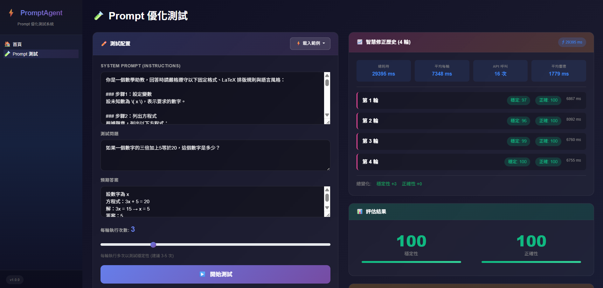
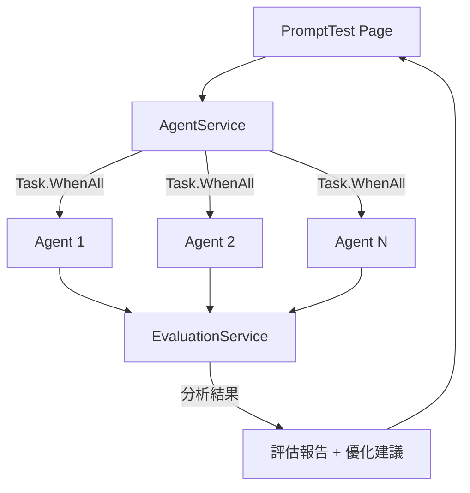

# ⚡ PromptAgent

> Prompt 優化測試系統 - 使用多輪平行測試和 AI 智慧評估來優化你的 Prompt


## ✨ 功能特色

- 🚀 **多輪平行執行** - 使用 `Task.WhenAll` 同時執行多個 Agent，快速測試 Prompt 穩定性
- 🧠 **AI 智慧評估** - 由更強的 AI 模型分析結果，給出專業評估報告
- ✨ **一鍵優化建議** - 自動生成優化後的 Prompt，一鍵套用立即改善效果
- 🎲 **AI 生成範例** - 使用 LLM 動態生成測試範例，支援數學、邏輯、翻譯、程式碼等類別

## 📸 截圖



## 🛠️ 環境需求

- [.NET 10.0](https://dotnet.microsoft.com/download) 或更高版本
- [Azure OpenAI Service](https://azure.microsoft.com/en-us/products/cognitive-services/openai-service/) 帳戶

## 🚀 快速開始

### 1. 複製專案

```bash
git clone https://github.com/yourusername/PromptAgent.git
cd PromptAgent
```

### 2. 配置 Azure OpenAI

複製範本檔案並填入你的 Azure OpenAI 連線資訊：

```bash
cp appsettings.template.json appsettings.json
```

然後編輯 `appsettings.json`：

```json
{
  "AzureOpenAI": {
    "Endpoint": "https://your-resource.openai.azure.com/",
    "ApiKey": "your-api-key",
    "DeploymentName": "gpt-4o-mini",
    "EvaluatorEndpoint": "https://your-evaluator-resource.openai.azure.com/",
    "EvaluatorApiKey": "your-evaluator-api-key",
    "EvaluatorDeploymentName": "gpt-4o"
  }
}
```

> 💡 **提示**: 建議使用較強的模型（如 GPT-4o）作為評估者，以獲得更準確的分析結果。

### 3. 執行專案

```bash
dotnet run
```

### 4. 開啟瀏覽器

訪問 http://localhost:5036

## 📁 專案結構

```
PromptAgent/
├── Models/
│   ├── TestCase.cs          # 測試案例模型
│   └── TestResult.cs        # 測試結果模型
├── Services/
│   ├── AgentService.cs           # Agent 管理服務 (Task.WhenAll 平行執行)
│   ├── EvaluationService.cs      # 評估服務 (使用更強模型分析)
│   └── ExampleGeneratorService.cs # LLM 驅動的範例生成服務
├── Components/
│   ├── Layout/              # 版面配置
│   └── Pages/               # 頁面元件
└── appsettings.json         # 配置檔案
```

## 🎯 使用方法

1. 點擊類別按鈕（🧮 數學、🧩 邏輯、🌐 翻譯、💻 程式）讓 AI 自動生成範例，或自行輸入
2. 填寫 **System Prompt**、**測試問題**、**預期答案**
3. 選擇 **執行次數**（1-10 次，建議 3-5 次）
4. 點擊「**開始測試**」
5. 查看 **穩定性** 和 **正確性** 評分
6. 若有優化建議，可點擊「**一鍵接受建議**」套用

## 🔧 技術架構



## 📝 授權

MIT License

## 🤝 貢獻

歡迎提交 Issue 和 Pull Request！
